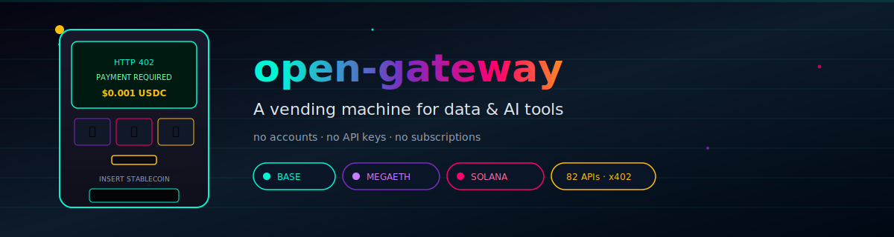
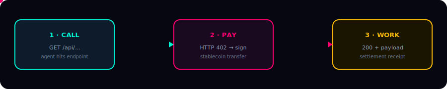
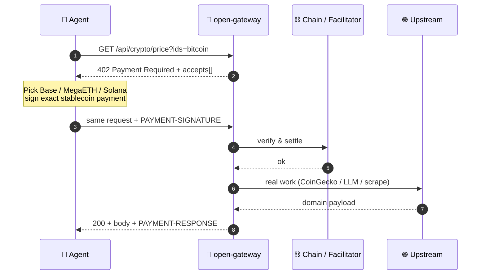

<p align="center">
  
</p>

<p align="center">
  <a href="https://github.com/Solizardking/open-gateway/actions"></a>
  <a href="./LICENSE"></a>
  
  
  
</p>

<p align="center">
  <b>⚡ Insert stablecoins. Get intelligence. No human in the loop.</b><br/>
  <sub>HTTP 402 · USDC/USDm · Base · MegaETH · Solana</sub>
</p>

---

```text
     ╔══════════════════════════════════════════════════════════╗
     ║   ██████╗ ██████╗ ███████╗███╗   ██╗                    ║
     ║  ██╔═══██╗██╔══██╗██╔════╝████╗  ██║   ░░▓▓▓▓░░         ║
     ║  ██║   ██║██████╔╝█████╗  ██╔██╗ ██║  ░░▓▓  ▓▓░░  💰    ║
     ║  ██║   ██║██╔═══╝ ██╔══╝  ██║╚██╗██║  ░░▓▓▓▓▓▓░░        ║
     ║  ╚██████╔╝██║     ███████╗██║ ╚████║   ░░░░░░░░         ║
     ║   ╚═════╝ ╚═╝     ╚══════╝╚═╝  ╚═══╝    GATEWAY         ║
     ╠══════════════════════════════════════════════════════════╣
     ║  [ A1 LLM ] [ B2 CRYPTO ] [ C3 WEB ] [ D4 COMPUTE ]     ║
     ║  ────────────────────────────────────────────────────   ║
     ║   ▸ no accounts   ▸ no API keys   ▸ no subscriptions    ║
     ║   ▸ pay $0.001 · get work · leave                       ║
     ╚══════════════════════════════════════════════════════════╝
```

## Why this hits different

Software shouldn't need a human to open a tab, verify an email, generate a key, paste it into `.env`, and babysit rate limits.

| Old world 😩 | open-gateway 🔥 |
|:---|:---|
| Sign up × N services | Fund a wallet once |
| Rotate API keys | **Payment is auth** |
| Monthly seats & overages | **$0.001 at a time** |
| Dashboards & invoices | Pure HTTP + stablecoins |
| Agents wait on humans | Agents **just pay and go** |

> *It's the difference between a gym membership and dropping a dime every time you use the treadmill.*

---

## 🚀 Blast off

```bash
# same vibe as: gh repo clone sensiml/open-gateway
gh repo clone Solizardking/open-gateway
cd open-gateway
npm install
npm start
# 🎧 listening on :8402
```

<details>
<summary><b>🎞️ plain git / no gh</b></summary>

```bash
git clone https://github.com/Solizardking/open-gateway.git
cd open-gateway && npm install && npm start
```
</details>

---

## 🎬 The movie (3 acts)

<p align="center">
  
</p>



### Act 1 — Toll booth

```bash
curl -i "http://127.0.0.1:8402/api/crypto/price?ids=bitcoin"
```

```http
HTTP/1.1 402 Payment Required
PAYMENT-REQUIRED: eyJ4NDAyVmVyc2lvbiI6Miw...
Content-Type: application/json

{
  "x402Version": 2,
  "error": "X-PAYMENT header is required",
  "accepts": [
    { "scheme": "exact", "network": "eip155:8453",  "maxAmountRequired": "1000", "...": "Base USDC" },
    { "scheme": "exact", "network": "eip155:4326",  "maxAmountRequired": "1e15", "...": "MegaETH USDm" },
    { "scheme": "exact", "network": "solana:5eykt…", "maxAmountRequired": "1000", "...": "Solana USDC" }
  ],
  "priceUsd": 0.001
}
```

### Act 2 — Coin drop

Wallet / `@x402/fetch` signs the amount, retries with payment attached. One round-trip. Your code only sees the data.

### Act 3 — Jackpot

```json
{
  "bitcoin": { "usd": 97234.12, "usd_24h_change": 2.31 },
  "_meta": { "paid": true, "source": "coingecko" }
}
```

`PAYMENT-RESPONSE` header = settlement receipt. ✨

---

## 🛰️ Networks — pick your lane

| | Network | CAIP-2 | Token | Decimals | Vibe |
|:--:|:---|:---|:--:|:--:|:---|
| **B** | Base | `eip155:8453` | USDC | 6 | Fast · Coinbase CDP facilitator |
| **M** | MegaETH | `eip155:4326` | USDm | 18 | ~10ms · direct on-chain energy |
| **S** | Solana | `solana:5eykt4UsjR1L6CXFJSXTa6TA4bRbYRk7x7xZjYj` | USDC | 6 | ~400ms · SVM native |

Every priced route advertises **all three** in `accepts[]`. Agents choose speed vs. cost.

---

## 🎰 Live slots (this build)

| Route | Price | What drops out |
|:---|:---:|:---|
| `GET /api/crypto/price` | **$0.001** | Real CoinGecko USD quotes |
| `POST /api/llm/gpt-4o-mini` | **$0.003** | Chat completion (OpenRouter when keyed) |
| `GET /api/web/scrape` | **$0.005** | URL → clean markdown / text |

**+ ~79 more catalog routes** across LLM · Compute · Crypto · Web · Travel · Storage — payment-gated, discoverable at `/catalog`. Unwired upstreams still require payment, then return `503 not_configured` (no free peeks).

```bash
curl -s localhost:8402/catalog | jq '.routeCount, (.categories|keys)'
# 82
# ["compute","crypto","llm","storage","travel","web"]
```

---

## 🧠 Agent one-liner

```ts
import { wrapFetchWithPayment, x402Client } from "@x402/fetch";
import { registerExactEvmScheme } from "@x402/evm/exact/client";
import { privateKeyToAccount } from "viem/accounts";

const account = privateKeyToAccount(process.env.EVM_PRIVATE_KEY!);
const client = new x402Client();
registerExactEvmScheme(client, { signer: account, networks: ["eip155:8453"] });

const paidFetch = wrapFetchWithPayment(fetch, client);

// 402 negotiation is invisible — you only see the juice
const res = await paidFetch("http://127.0.0.1:8402/api/crypto/price?ids=bitcoin");
console.log(await res.json());
```

---

## 🔒 Security (not a toy)

| Rule | Reality |
|:---|:---|
| `scheme: "exact"` + matching amount alone | **Rejected** — not payment |
| No facilitator configured | **402** `unverified_payment_no_facilitator` |
| `x402Test: true` | Only if `X402_ALLOW_TEST_PAYMENTS=1` (never prod) |
| Invalid / underpaid | **No billed work runs** |

Production: set `X402_FACILITATOR_URL` + `X402_PAY_TO_EVM` / `X402_PAY_TO_SOLANA`. See [`.env.example`](./.env.example).

---

## 🧪 Prove it

```bash
npm test
# 17/17 — unpaid 402 · forge reject · paid crypto/LLM/scrape · facilitator path
```

<details>
<summary><b>📁 layout</b></summary>

```text
src/
├── app.js            # Express factory — free discovery + paid /api/*
├── server.js         # entry
├── catalog.js        # 82-route menu
├── networks.js       # CAIP-2 + atomic USDC/USDm math
├── payment.js        # requirements · verify · settlement
├── middleware.js     # the toll booth
└── handlers/         # crypto · llm · web
assets/
├── banner.svg        # animated hero
└── flow.svg          # call → pay → work
```
</details>

<details>
<summary><b>🧭 free discovery surfaces</b></summary>

```bash
curl -s localhost:8402/health          | jq .
curl -s localhost:8402/catalog         | jq .
curl -s localhost:8402/.well-known/x402| jq .
```
</details>

<details>
<summary><b>📚 reference clones (optional study)</b></summary>

```bash
gh repo clone sensiml/open-gateway vendor/sensiml-open-gateway
gh repo clone coinbase/x402 vendor/coinbase-x402
gh repo clone shinothelegend/null-402-gateway vendor/null-402-gateway
```

See [REFERENCES.md](./REFERENCES.md).
</details>

---

## 🌌 Built for autonomous software

| Agent fantasy | Routes | ~cost |
|:---|:---|:---:|
| “What happened to BTC this week?” | `crypto/price` + `history` | ~$0.004 |
| Portfolio bot hourly pulse | `wallet/balances` + `trending` | ~$0.006 |
| Blog needs a hero image | `image/fast` | $0.015 |
| Did this code actually run? | `code/run` | $0.005 |
| Meeting → speakers + timestamps | `transcribe` | $0.10 |
| Pin the report forever | `ipfs/pin` | $0.01 |

**No CoinGecko account. No Midjourney plan. No Docker babysitting.** Just wallets and HTTP.

---

<p align="center">
  <code>npm start</code> · drop a fraction of a cent · walk away with work<br/>
  <sub>MIT · made for agents that don't ask for permission</sub>
</p>

<p align="center">
  
</p>
